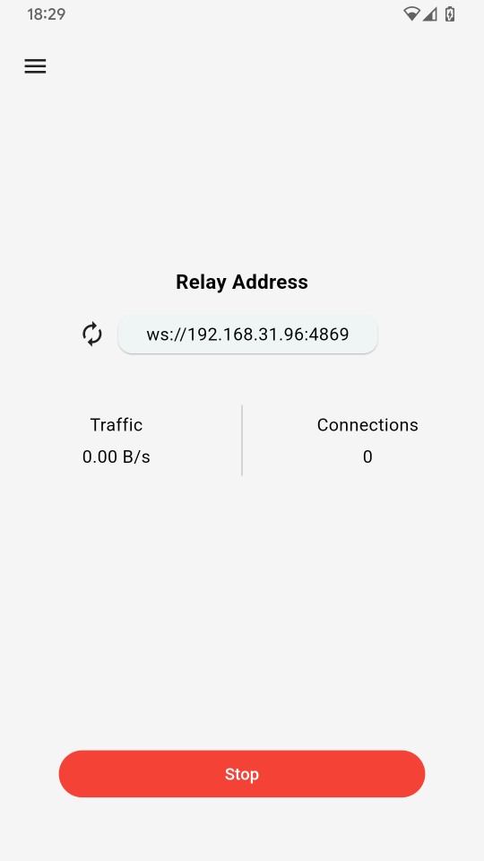

<div align="center">


# Cache Relay

A multi-platform cache relay

</div>

## Downloads

You can download From [Release](https://github.com/haorendashu/cache_relay/releases) https://github.com/haorendashu/cache_relay/releases

## Screenshots

[](./screenshots/screenshot1.png)
[](./screenshots/screenshot2.png)

## Git Module

Cache Relay is a multi module project, after you clone this project, please run git module scrpit to init the module git repos.

``` bash
git submodule init
git submodule update
```

## Build Script

### Android

```
-- build for appbundle
flutter build appbundle --release

-- build for apk
flutter build apk --release --split-per-abi
```

### IOS and MacOS

build by XCode

### Windows

```
flutter build windows --release
```

### Linux

Linux depend on ```libsecret-1-dev```, ```libsqlite3-0```, ```libsqlite3-dev``` you can try to run this script to install before it run: 

Ubuntu:

```
sudo apt-get -y install libsecret-1-dev libsqlite3-0 libsqlite3-dev
```

Fedora:

```
sudo dnf install libsecret-devel sqlite3 sqlite-devel
```

```
flutter build linux --release
```

#### About Linux package

We use ```flutter_distributor``` to build linux package, so you should install ```flutter_distributor``` and add some other config.

Install ```flutter_distributor``` to your system:

```
dart pub global activate flutter_distributor
```

Install some compile tools:


```
sudo apt-get install clang cmake git ninja-build pkg-config libgtk-3-dev liblzma-dev libstdc++-12-dev
```

rpm package requirements:

Debian/Ubuntu: 

```
apt install rpm patchelf
```

Fedora: 

```
dnf install gcc rpm-build rpm-devel rpmlint make python bash coreutils diffutils patch rpmdevtools patchelf
```

Arch:

```
yay -S rpmdevtools patchelf or pamac install rpmdevtools patchelf
```

appimage package requirements:

install ```flutter_distriutor```

```
dart pub global activate flutter_distributor
```

install and update filedbs:

```
sudo apt install locate
sudo updatedb
```

install Appimage Builder:

```
wget -O appimagetool "https://github.com/AppImage/AppImageKit/releases/download/continuous/appimagetool-x86_64.AppImage"
chmod +x appimagetool
sudo mv appimagetool /usr/local/bin/
```

If your config all the steps, you can run these script to package the packages:

```
flutter_distributor release --name=dev --jobs=release-dev-linux-deb
flutter_distributor release --name=dev --jobs=release-dev-linux-rpm
flutter_distributor release --name=dev --jobs=release-dev-linux-appimage
```